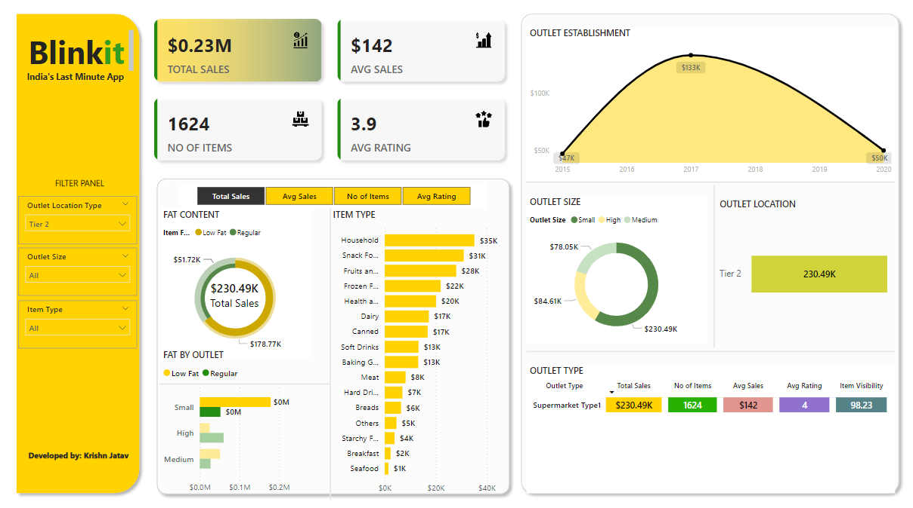

# 🛒 Blinkit Sales Analytics Dashboard

<p align="center">
  
</p>

## 📊 Overview

A comprehensive **Power BI dashboard** that provides deep insights into Blinkit's grocery sales performance. This interactive dashboard transforms raw sales data into actionable business intelligence, helping stakeholders make data-driven decisions.

## ✨ Features

- **📈 Sales Performance Tracking**: Monitor total sales, average sales, and trends over time
- **📦 Product Analytics**: Analyze item performance, categories, and inventory insights  
- **⭐ Customer Satisfaction**: Track ratings and customer feedback metrics
- **🎯 KPI Monitoring**: Real-time key performance indicators with custom visuals
- **📱 Interactive Visualizations**: Drill-down capabilities and dynamic filtering
- **📊 Comprehensive Reporting**: Multiple dashboard views for different stakeholder needs

## 🚀 Quick Start

### Prerequisites

- **Microsoft Power BI Desktop** (Latest version recommended)
- **Excel** (For viewing/editing data source)
- Windows 10/11 (recommended for optimal performance)

### Getting Started

1. **Clone the repository**
   ```bash
   git clone https://github.com/krishn1122/blinkit-dashboard-PowerBI.git
   cd blinkit-dashboard-PowerBI
   ```

2. **Open the Dashboard**
   - Launch Power BI Desktop
   - Open `dashboard/Blinkit Sales Dashboard.pbix`
   - The dashboard will load with the included sample data

3. **Explore the Data**
   - View the Excel data source: `data/BlinkIT Grocery Data.xlsx`
   - Refresh data connections if needed
   - Explore different dashboard pages and visualizations

## 📁 Repository Structure

```
blinkit-dashboard-PowerBI/
├── 📊 dashboard/
│   └── Blinkit Sales Dashboard.pbix     # Main Power BI dashboard file
├── 📈 data/
│   └── BlinkIT Grocery Data.xlsx        # Source data (Excel format)
├── 🎨 assets/
│   ├── background-kpi.png               # KPI background design
│   ├── avg-sales-icon.png              # Average sales indicator
│   ├── sales-icon.png                  # Sales metrics icon
│   ├── items-icon.png                  # Items/products icon
│   └── rating-icon.png                 # Customer rating icon
├── 📸 screenshots/
│   └── blinkit-dashboard.png           # Dashboard overview screenshot
├── 🎥 demo/
│   └── Blinkit PowerBI dashbard.mp4    # Dashboard demonstration video
├── 📚 documentation/
│   ├── SETUP.md                        # Detailed setup instructions
│   ├── USER_GUIDE.md                   # User manual and guide
│   └── DATA_SCHEMA.md                  # Data structure documentation
├── README.md                           # This file
├── LICENSE                             # License information
├── CHANGELOG.md                        # Version history and updates
└── .gitignore                          # Git ignore rules
```

## 📊 Dashboard Highlights

### Key Metrics Displayed
- **💰 Total Sales Revenue**: Real-time sales performance tracking
- **📦 Product Performance**: Top-selling items and categories
- **⭐ Average Rating**: Customer satisfaction metrics
- **📈 Sales Trends**: Time-series analysis and forecasting
- **🏪 Outlet Performance**: Store-wise performance comparison

### Interactive Features
- **🔍 Dynamic Filtering**: Filter by date, category, outlet, and more
- **📱 Responsive Design**: Optimized for different screen sizes
- **🎯 Drill-Down Analysis**: Click to explore detailed insights
- **📊 Multiple Chart Types**: Bar charts, line graphs, pie charts, and KPI cards

## 🛠️ Customization

### Updating Data
1. Replace data in `data/BlinkIT Grocery Data.xlsx`
2. Open Power BI Dashboard
3. Go to **Home** → **Refresh** to update visualizations

### Modifying Visuals
1. Open the `.pbix` file in Power BI Desktop
2. Enter **Edit** mode
3. Customize charts, colors, and layouts as needed
4. Save your changes

## 📱 Demo

Watch the dashboard in action:
- **Video Demo**: Check out `demo/Blinkit PowerBI dashbard.mp4` for a complete walkthrough
- **Live Screenshots**: View `screenshots/` folder for static previews

## 🤝 Contributing

We welcome contributions! Please follow these steps:

1. Fork the repository
2. Create your feature branch (`git checkout -b feature/AmazingFeature`)
3. Commit your changes (`git commit -m 'Add some AmazingFeature'`)
4. Push to the branch (`git push origin feature/AmazingFeature`)
5. Open a Pull Request

## 📄 License

This project is licensed under the MIT License - see the [LICENSE](LICENSE) file for details.

## 📞 Support & Contact

- **Issues**: Report bugs or request features via [GitHub Issues](https://github.com/krishn1122/blinkit-dashboard-PowerBI/issues)
- **Discussions**: Join conversations in [GitHub Discussions](https://github.com/krishn1122/blinkit-dashboard-PowerBI/discussions)

## 🙏 Acknowledgments

- **Blinkit** for inspiring this analytics dashboard
- **Microsoft Power BI** for providing excellent visualization tools
- **Community** for feedback and contributions

---

<p align="center">
  <b>⭐ Star this repository if you found it helpful!</b>
</p>

<p align="center">
  Made with ❤️ for data-driven insights
</p>